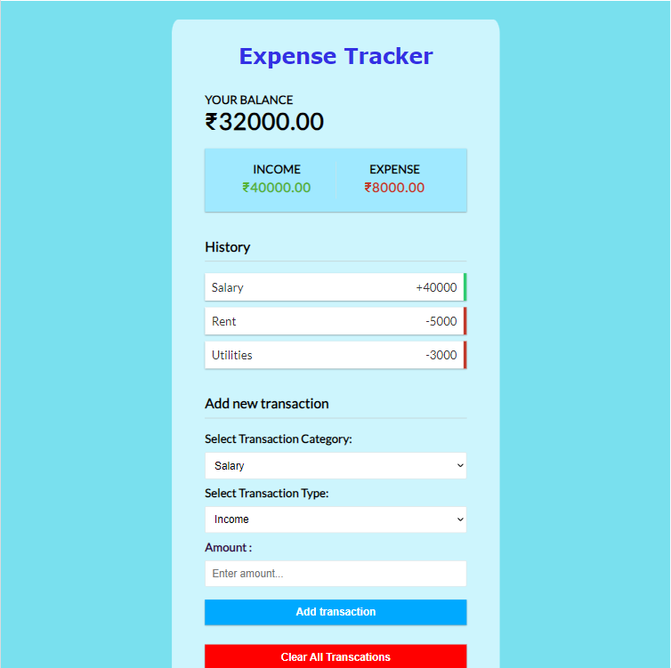

# ExpenseTracker-v1

This a repo contains Expense Tracker Project made using html, css and javascript.  
This project keeps track of income and expenses. Add or remove items and save data to local storage.

## Project Specifications

-   Create a UI for project
-   Display transaction items in DOM
-   Show balance, expense and income totals
-   Add new transation and reflect in total
-   Delete items from DOM
-   Persist Data to local storage

## UI

